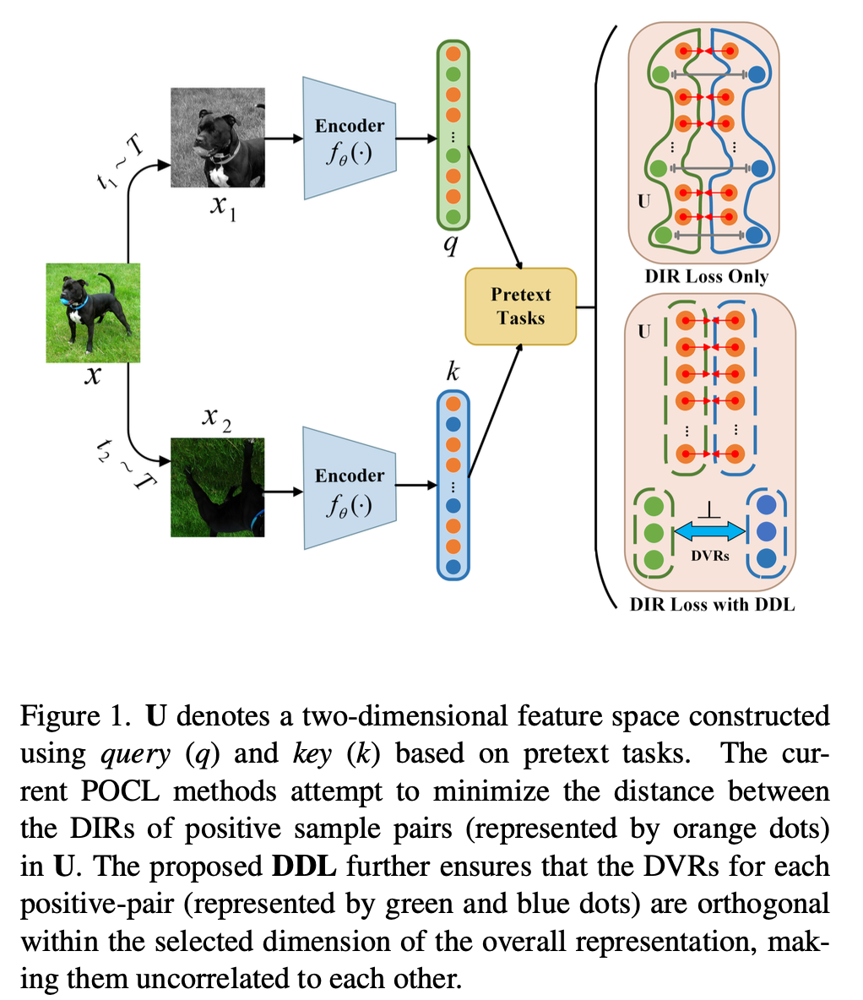
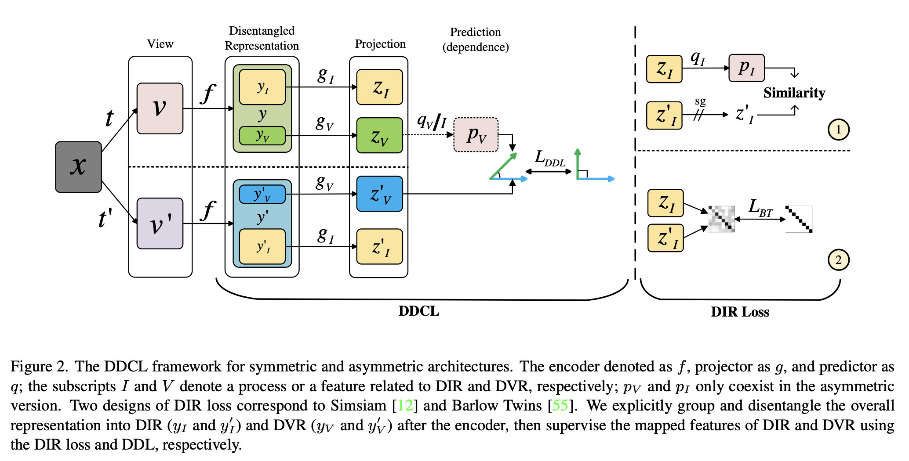
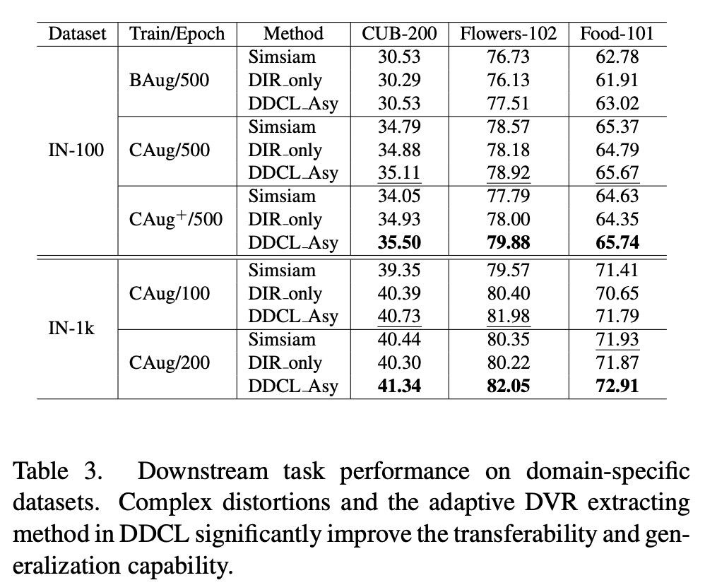
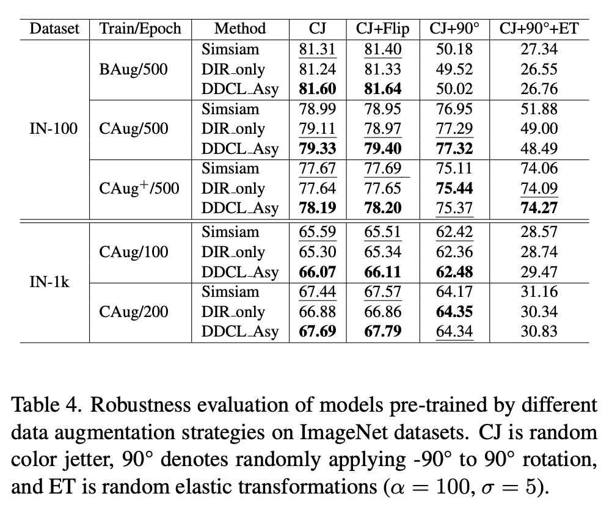
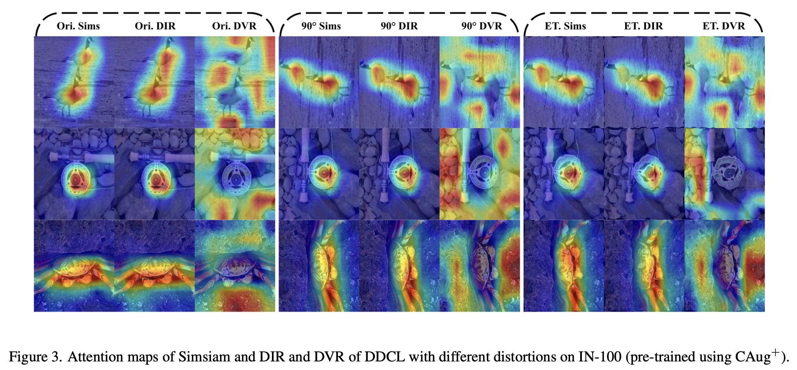

# Distortion-Disentangled Contrastive Learning (DDCL)

[](https://wacv2024.thecvf.com/)
[]([https://arxiv.org/abs/2303.05066](https://openaccess.thecvf.com/content/WACV2024/html/Wang_Distortion-Disentangled_Contrastive_Learning_WACV_2024_paper.html))
[]([https://arxiv.org/pdf/2303.05066.pdf](https://openaccess.thecvf.com/content/WACV2024/papers/Wang_Distortion-Disentangled_Contrastive_Learning_WACV_2024_paper.pdf))
[]()
[]()
[]()

## Updates

- Our code will be released in the very near future.
- 17/Dec/2023: The code repository is publicly available.
- 29/Nov/2023: Our paper "Distortion-Disentangled Contrastive Learning (DDCL)" was accepted to **WACV2024 (847/2042)** as an **ORAL (53/2042)** paper!

## Abstract

Recently, Positive-pair-Only Contrastive Learning (POCL) has achieved reliable performance without the need to construct positive-negative training sets. The POCL method typically uses a single objective function to extract the distortion invariant representation (DIR) which describes the proximity of positive-pair representations affected by different distortions. This objective function implicitly enables the model to filter out or ignore the distortion variant representation (DVR) affected by different distortions. However, some recent studies have shown that proper use of DVR in contrastive can optimize the performance of models in some downstream domain-specific tasks. In addition, these POCL methods have been observed to be sensitive to augmentation strategies. To address these limitations, we propose a novel POCL framework named Distortion-Disentangled Contrastive Learning (DDCL) and a Distortion-Disentangled Loss (DDL). Our approach is the first to explicitly and adaptively disentangle and exploit the DVR inside the model and feature stream to improve the representation utilization efficiency, robustness and representation ability. Experiments demonstrate our framework’s superiority to Barlow Twins and Simsiam in terms of convergence, representation quality (including transferability and generalization), and robustness on several datasets.

<p align="center">
  
</p>
<p align="center">
  
</p>

## Experiments

<p align="center">
   
</p>

## Visualization



# Citation

If you find our DDCL useful in your research, please star this repository and consider citing:
```
@inproceedings{wang2024distortion,
  title={Distortion-Disentangled Contrastive Learning},
  author={Wang, Jinfeng and Song, Sifan and Su, Jionglong and Zhou, S Kevin},
  booktitle={Proceedings of the IEEE/CVF Winter Conference on Applications of Computer Vision},
  pages={75--85},
  year={2024}
}
```

# Acknowledgments

- Thanks Simsiam ([official](https://github.com/facebookresearch/simsiam), [small datasets](https://github.com/Reza-Safdari/SimSiam-91.9-top1-acc-on-CIFAR10)) and Barlow Twins ([official](https://github.com/facebookresearch/barlowtwins?tab=readme-ov-file), [small datasets](https://github.com/IgorSusmelj/barlowtwins)) for their public code and released models. 
